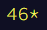

# Advent of Code 2021 

In the words of its creator Eric Wastl:

*"<a href="https://adventofcode.com/">Advent of Code</a> is an Advent calendar of small programming puzzles for a variety of skill sets and skill levels that can be solved in any programming language you like. People use them as a speed contest, interview prep, company training, university coursework, practice problems, or to challenge each other."*

I discovered Advent of Code just before the <a href="https://adventofcode.com/2021">2021</a> installment, and decided to challenge myself to complete every puzzle and to publish the results here.

I was able to get **33** out of 50 stars on the day of release of each puzzle, and am currently working through the remaining ones.

## Notes about the table below

- Times for parts of puzzles I solved on the day of release shown in light text in the format [actual time/official time (rank)]. If the time says ??:??:??, it just means I stopped timing myself for that part but stil completed it on the same day.
- Solutions after the day of release of the puzzle are included in **bold** text in the format **[date solved (rank)]**.
- Puzzles were released at 5am GMT (midnight EST) each day. If the start time is the same as the actual time in the table below, I was awake and began working on my solution at 5am and the rank includes only others who started at the same time. If the start and actual time are different, I began working on my solution later in the day so the rank includes others who started before me.
- The links in the first column of the table link either to a readme file with a description of my solution, or directly to the finished/unfinished source code. You can also find original versions of the source code, etc. in the subfolder for each day in <a  href="/solutions">this folder</a>.
- I also recorded myself solving some of the problems and created a YouTube playlist [here](https://www.youtube.com/watch?v=IhhJfaYf4XU&list=PLqVT60R9nVJDvFUBUTh4BjA4W-IEL91gS).

## Stats & solutions

<table style="margin-left:auto; margin-right:auto">

  <tr>
    <td></td>
    <th style="text-align:center">Part 1</th>
    <th style="text-align:center">Part 2</th>
  </tr>

  <tr>
    <th scope="row"><a href="/solutions/day1/solution-tidied.py">Day 1</a></th>
    <td>00:02:24 / 00:02:24 (942)</td>
    <td>00:07:38 / 00:07:38 (1553)</td>
  </tr>

  <tr>
    <th scope="row"><a href="/solutions/day2/solution-tidied.py">Day 2</a></th>
    <td>00:05:15 / 00:05:15 (3354)</td>
    <td>00:07:01 / 00:07:01 (2180)</td>
  </tr>

  <tr>
    <th scope="row"><a href="/solutions/day3/solution-tidied.py">Day 3</a></th>
    <td>00:08:50 / 00:53:54 (13726)</td>
    <td>00:18:40 / 01:03:42 (7012)</td>
  </tr>

  <tr>
    <th scope="row"><a href="/solutions/day4/solution-tidied.py">Day 4</a></th>
    <td>00:16:58 / 00:16:58 (852)</td>
    <td>00:25:05 / 00:25:05 (1056)</td>
  </tr>

  <tr>
    <th scope="row"><a href="/solutions/day5/solution-tidied.py">Day 5</a></th>
    <td>00:26:45 / 03:13:51 (13748)</td>
    <td>00:56:25 / 03:43:29 (12838)</td>
  </tr>
  
  <tr>
    <th scope="row"><a href="/solutions/day6/solution-tidied.py">Day 6</a></th>
    <td>00:14:20 / 00:14:20 (4900)</td>
    <td>00:28:43 / 00:28:43 (3340)</td>
  </tr>

  <tr>
    <th scope="row"><a href="/solutions/day7/solution-tidied.py">Day 7</a></th>
    <td>00:07:40 / 01:48:26 (16245)</td>
    <td>00:12:58 / 01:53:42 (14942)</td>
  </tr>

  <tr>
    <th scope="row"><a href="/solutions/day8/solution-tidied.py">Day 8</a></th>
    <td>00:09:53 / 01:09:03 (11973)</td>
    <td>around 01:45:00 / 10:19:39 (23567)</td>
  </tr>

  <tr>
    <th scope="row"><a href="/solutions/day9/solution-tidied.py">Day 9</a></th>
    <td>00:22:50 / 00:22:50 (5353)</td>
    <td>01:51:34 / 01:51:34 (8092)</td>
  </tr>

  <tr>
    <th scope="row"><a href="/solutions/day10/solution-tidied.py">Day 10</a></th>
    <td>00:11:40 / 00:11:40 (2079)</td>
    <td>00:22:19 / 00:22:19 (2206)</td>
  </tr>

  <tr>
    <th scope="row"><a href="/solutions/day11/solution-tidied.py">Day 11</a></th>
    <td>00:20:23 / 07:42:23 (20233)</td>
    <td>00:22:34 / 07:44:34 (19826)</td>
  </tr>

  <tr>
    <th scope="row"><a href="/solutions/day12/solution-tidied.py">Day 12</a></th>
    <td>01:13:21 / 01:46:21 (6920)</td>
    <td>01:26:02 / 01:59:02 (5916)</td>
  </tr>

  <tr>
    <th scope="row"><a href="/solutions/day13/">Day 13</a></th>
    <td>01:33:34 / 01:33:34 (8252)</td>
    <td>02:35:16 / 02:35:16 (9840)*</td>
  </tr>

  <tr>
    <th scope="row"><a href="/solutions/day14/">Day 14</a></th>
    <td>00:08:31 / 02:48:31 (13540)</td>
    <td><b>27th Dec 2021 (41540)</b></td>
  </tr>

  <tr>
    <th scope="row"><a href="/solutions/day15/">Day 15</a></th>
    <td>01:02:09 / 01:02:09 (3999)</td>
    <td><b>28th Dec 2021 (34521)</b></td>
  </tr>

  <tr>
    <th scope="row"><a href="/solutions/day16/solution-unfinished.py">Day 16</a></th>
    <td>NOT YET</td>
    <td>NOT YET</td>
  </tr>

  <tr>
    <th scope="row"><a href="/solutions/day17/solution-unfinished.py">Day 17</a></th>
    <td>00:55:49 / 01:27:49 (5126)</td>
    <td>??:??:?? / 15:52:01 (17995)</td>
  </tr>

  <tr>
    <th scope="row">Day 18</th>
    <td>NOT YET</td>
    <td>NOT YET</td>
  </tr>

  </tr>
    <tr>
    <th scope="row">Day 19</th>
    <td>NOT YET</td>
    <td>NOT YET</td>
  </tr>

  <tr>
    <th scope="row"><a href="/solutions/day20">Day 20</a></th>
    <td>??:??:?? / 01:37:36 (3269)*</td>
    <td><b>1st January 2022 (20561)</b></td>
  </tr>

  <tr>
    <th scope="row"><a href="/solutions/day21/solution-part-one-tidied.py">Day 21</a></th>
    <td>00:29:14 / 00:42:14 (3923)</td>
    <td>NOT YET</td>
  </tr>

  <tr>
    <th scope="row"><a href="/solutions/day22/solution-tidied.py">Day 22</a></th>
    <td>00:29:42 / 00:29:42 (2451)</td>
    <td>NOT YET</td>
  </tr>

  <tr>
    <th scope="row"><a href="/solutions/day23/">Day 23</a></th>
    <td><b>2nd January 2021 (13515)</td>
    <td>NOT YET</td>
  </tr>

  <tr>
    <th scope="row">Day 24</th>
    <td>NOT YET</td>
    <td>NOT YET</td>
  </tr>

  <tr>
    <th scope="row"><a href="/solutions/day25/">Day 25</a></th>
    <td><b>29th Dec 2021 (13044)</b></td>
    <td>NOT YET</td>
  </tr>
</table>
