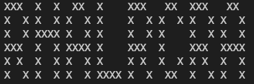

# --- Day 13: Transparent Origami ---

## Problem statement

[here](https://adventofcode.com/2021/day/13).

## Part One

Solved through trial and error using a list of lists.

## Part Two

Found that the output after carrying out all of the folds was slightly garbled and it was not possible to make out the letters.

I could not diagnose the problem and doubted whether I was reading the numbers correctly, so cheated by using some code from the subreddit to get the solution. After stewing on the problem overnight, I realised that I needed to add extra rows/columns to make the numbers odd for my method to work, so added the following code:

```python
# My method needs odd numbers of rows and columns to work
if num_rows % 2 == 0:
    num_rows = num_rows + 1
if num_columns % 2 == 0:
    num_columns = num_columns + 1
```

The result:

</img>

See the code [here](solution-tidied.py).