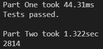

# --- Day 15: Chiton ---

## Problem statement

[here](https://adventofcode.com/2021/day/15).

## Part One

Solved by implementing Djikstra's algorithm based on the [psuedocode](https://en.wikipedia.org/wiki/Dijkstra%27s_algorithm#Pseudocode) on Wikipedia.

See the code [here](solution-part-one.py).

## Part Two

Generated the larger matrix and found that the code from Part One was too slow (no result after waiting at least 20 minutes).

Got the idea of using a priority heap from the [subreddit](https://www.reddit.com/r/adventofcode/comments/rgqzt5/2021_day_15_solutions/) and implemented using the [heapq](https://docs.python.org/3/library/heapq.html) library based on the instructions on the [Wikipedia](https://en.wikipedia.org/wiki/Dijkstra's_algorithm#Using_a_priority_queue) page.

Final step was to replace:

```python
if (x,y) in nodes:
```

with:

```python
if x > -1 and y > -1 and x < matrix_height and y < matrix_width:
```

which reduced running time for the matrix from Part One from around 5s to around 50ms and completed for the larger matrix for Part Two in less than 1.5s.

</img>

See the code [here](solution-part-two.py).