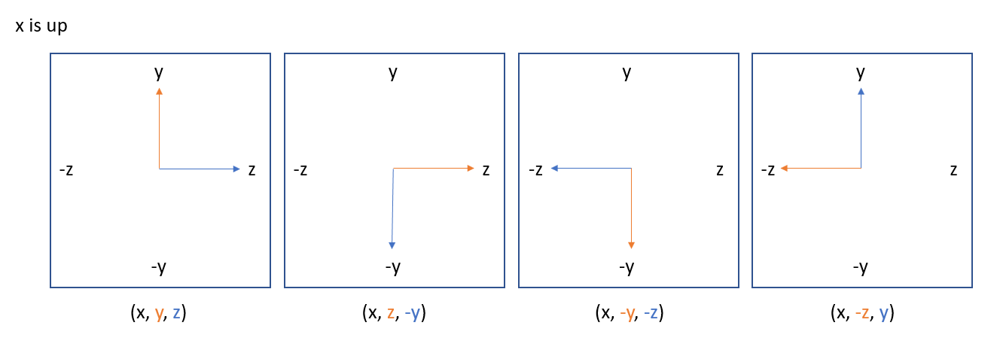

# --- Day 19: Beacon Scanner ---

## Problem statement

[here](https://adventofcode.com/2021/day/19)

I think I gave up after about ten minutes on the day and ended up saving this one til near the end as the problem statement broke my mind. The final solution is not pretty but I got the answers out a bit more easily than I'd originally anticipated.

It took me a while to get my head ahead the different orientations but after a while reading through the subreddit I was able to work these out with the help of some diagrams I drew for myself like this:

</img>

After realising it would take too long to shift the space by one unit at a time in each direction until beacons overlapped, I found an efficient method where I compute distances between x, y, and z values in turns for different pairs of scanners and orientations to gradually whittle down to the correct orientation.

## Part One

The hardest part was expressing each beacon location relative to a single scanner's location in order to determine which observations were of the same beacon. A big breakthrough was realising that the points could be relative to any scanner as long as it was the same one, so I gave up on trying to get locations relative to scanner 0 and just stuck with whichever orientation/position I ended up in.

I didn't have the patience to work through determining a path through the orientations such that every scanner is covered, which as far as I can tell would amount to going from the list of all pairs of overlapping scanners:

```
[(0, 2), (0, 26), (1, 7), (1, 13), (1, 17), ...]
```

to an ordered subset such that adjacent values are equal and each scanner number is included at least once, something like:

```
[(0, 2), (2, 8), (8, 15), ...]
```

Instead I tried my luck at just choosing from the next possible step at random and found that this still gave me the answer almost immediately.

## Part Two

Wasted another couple of hours getting fixated on trying to get the positions of each scanner relative to scanner 0, then similarly to Part 1 realised that the point of reference is irrelevant and that I could just plug in (0, 0, 0) to make each scanner track its own position and then search for the greatest Manhattan distance.

See the code [here](solution-final.py).
