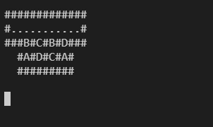
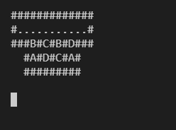

# --- Day 23: Amphipod ---

## Problem statement

[here](https://adventofcode.com/2021/day/23)

## Part One

One of my favourites so far. Took several hours of trial and error but I could see constant progression towards and the goal and it was very satisfying when it paid off.

I started by defining a class to capture burrow states and replicating the steps in the example to test my model and energy calculations.

</img>

I then extended the class to generate a list of next possible states and wrote a function to visualise a sequence of random steps.

</img>

This helped when optimising to choose the best steps at each point. Once I had optimised the generation of next possible steps enough, I was able to search through all possible sequences of steps by spawning new burrow states at each step and discarding any that went over the minimum so far or where no further moves were possible.

The code takes around 1 minute 45 seconds to run.

See the code [here](solution-part-one.py).

## Part Two

No major changes to how the code works—I just had to make it more abstract as I had hard-coded the 2-row structure in Part One. I use a list of lists to represent the start of the burrow in place of the separate dictionaries for each row used in Part One.

The code takes around 

See the code [here](solution-part-two.py).